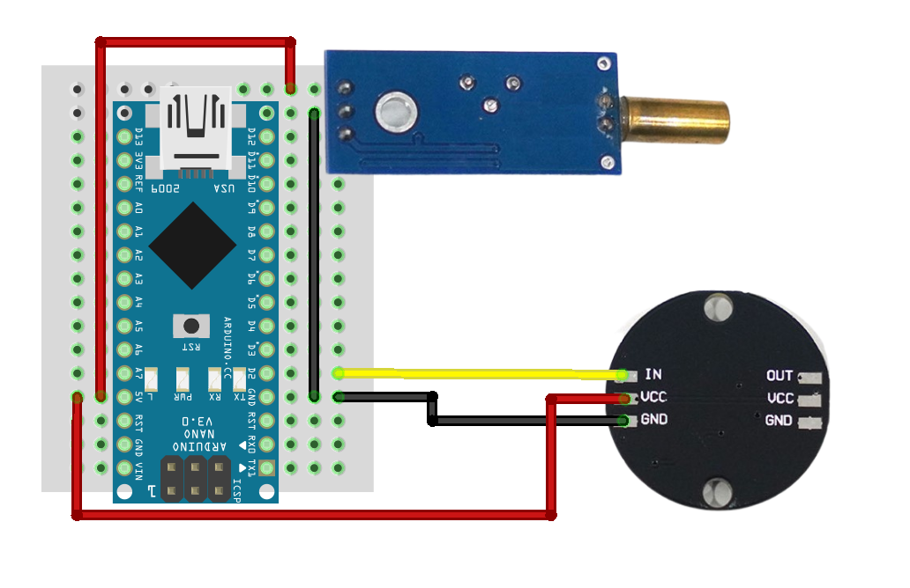
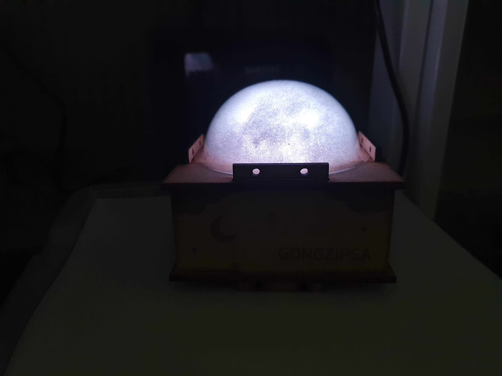

# Gongzipsa 무드등 제작

- 시제품으로 6색깔중 랜덤으로 불이 들어오도록 제작
	- tilt센서를 이용하여 제품 충격시 세 색깔중 랜덤하게 결정

- tilt 센서를 45도로 기울여 충격센서 처럼 사용

## 사용 부품
- Arduino Nano
- Tilt sensor/SW-520D
- NeoPixel 원형

## 라이브러리
- Adafruit NeoPixel

## 결선이미지

## 제품사진

## 일자별 진행상황
|날짜|진행사항|특이사항|
|--|--|--|
|2022/09/30|시제품 제작 완료|tilt 센서 사이즈 호환불가로 제외하여 제작|
|2022/10/04|tilt 센서 사용으로 인한 tilt_random_code.cpp 작성|tilt센서를 눕혀서 사용해도 무방하여 사이즈 호환 가능|
|2022/10/07|tilt_random_code.cpp 작성, tilt 감도 가장 낮게 설정||
|2022/10/26|main_code.ino 업로드||
|2022/12/05|결선이미지, 제품사진 추가|Update readme|
